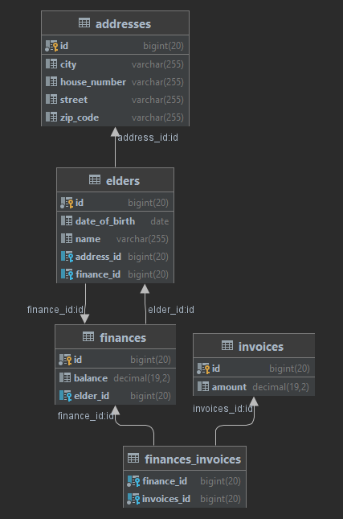

# Az alábbi repository a vizsgaremekemet tartalmazza,

a program idősek otthonának íródott, amely segítségével tárolni lehet a bentlakók adatait, mint név és születési dátum,
lakcím. Ezen kívül lehetőség van rögzíteni a bentlakók pénzügyi kiadásait, mindenkihez tartozik egy pénzügyek funkció,
ahol rögzjteni lehet a kiadásokat, bevételeket, és ezeket a pénzmozgásokat kommentelni is kehet (pl: nyugdíj).

## Techológiák

* Klasszikus háromrétegű alkalmazás
* Java Spring backenddel
* REST webszolgáltatásokkal.
* Spring Data JPA adatbáziskezelés
* MariaDB adatbázissal
* Flyway migrációs adatbázis verziókezelés
* Swagger
* Integrációs tesztek RestTemplate használatával
* Unit tesztek Mockolt service rétegekkel

## Entitások és kapcsolataik

* Bentlakó (Elder)
* Lakcím (Address)
* Pénzügy (Finance)
* Számla (Invoice)
  

## Végpontok:

###### Az alkalmazás elindítása után dokumentáció elérhetó a localhost:8080/swagger-ui.html címen

* ElderController végpontjai:
    * /api/elders
        * Ezen a végponton megvalósítható egy kérés, ami listázza a idősotthon lakóit, vagy
        * vagy egy PostMapping kéréssel felvehető egy új bentlakó
    * /api/elders/{id}
        * Get kéréssel lekérdezhetó az adott id-ú bentlakó.
    * /api/elders/{id}/address
        * Frissíteni lehet az adott id-jú bentlakó lakcímét.
    * /api/elders/{id}/delete
      *törölni lehet az adott id-jú bentlakót, töröl minden hozzű tartozó adatot (CascadeType.REMOVE)

* FinanceController végpontjai:
  * /api/finances
    * Frissíteni lehet egy bentlakó pénzügyeit.
  * /api/finances/elder/{id}
    * A bentlakó Id-ja alapján le lehet kérdezni a pénzügyeit 
  * /api/finances/elder/{id}/invoice
    * Be lehet küldeni egy új számlát az adott id-jú bentlakónak. 
  
### Features

* Egészségügyi események rögzítéséhez tartozó táblák kialakítása
    * Orvosi vizsgálatok mentése.
        * Betegségek mentése n-m kapcsolattal
    * N-m kapcsolat kialakítása a gyógyszerek és az idősek között.

* Látogatások rögzítése

